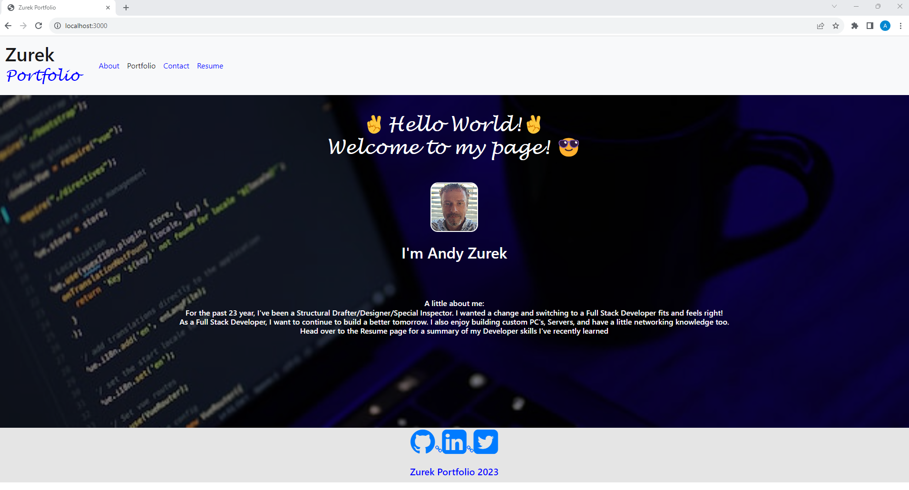

# react-zurek-portfolio 

[Visit Deployed link](#)

## Technology Used:

 * node - https://nodejs.org/en/about
 * npm - https://www.npmjs.com/
 * react - https://react.dev/
 * react-dom - https://legacy.reactjs.org/docs/react-dom.html
 * react-router-dom - https://reactrouter.com/en/main
 * vite - https://vitejs.dev/
 * eslint - https://eslint.org/
 

 ## Description

 A Portfolio created using React and a few additional technologies listed above. 

 ## Table of Contents
  
   * [Installation](#installation)
   * [Usage](#usage)
   * [License](#license)
   * [Badges](#badges)
   * [Tests](#tests)
   * [Contributing](#contributing)
   * [Credits](#credits)

## Installation

* To install all dependences, run: npm install
* To build and start the server, run: npm run start

## Usage

When the page loads. the user see a navbar on the top a About page then a footer.
When you click the navbar sections: About, Portfolio, Contact, Resume, you are directed to that page. 
You might also notice the text change color as you hover over them, and the current page will be have a different color.
In the Portfolio Page you will notive the project icons and webpage link are hidden until you hover over the project cards.
In the Resume Page, I have a link in the button that direct you to a resume to download.

## License

 This project is licensed with MIT license

 Link to License - [Website to MIT License]((https://opensource.org/license/mit))

 ## Badges

 

 ## Tests
 
 This application has no testing

 ## Contributing

 Contact me if you interested in contributing:

 Check out my [github](https://github.com/AZurek17) page or send me a [email](mailto:andyzurek@gmail.com)

 ## Credits

 * ChatGPT
 * StudyGroup

 &copy;2023, Written by Andy Zurek